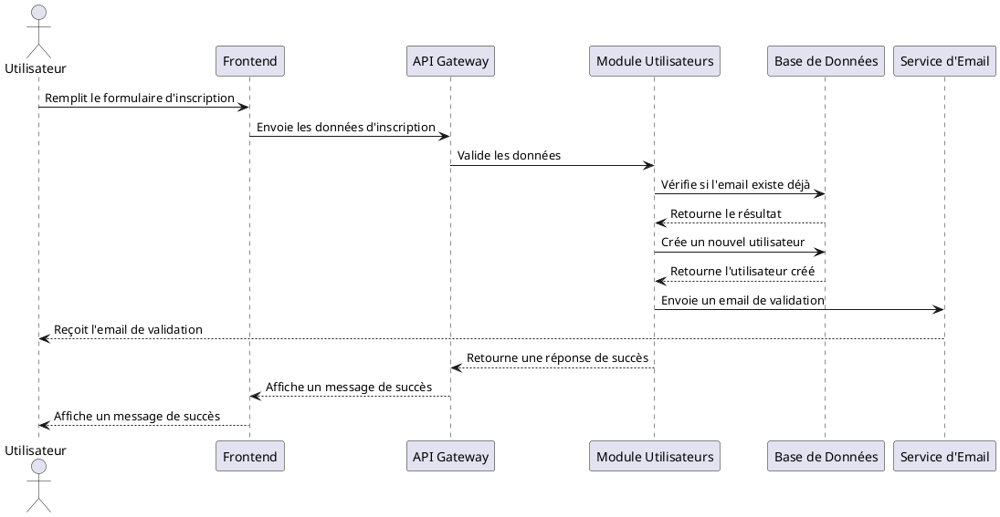
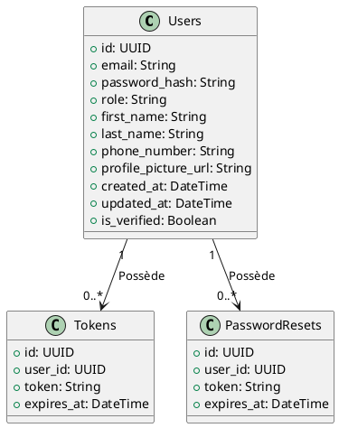

# immo


<details>
    <summary>Cahier de charge</summary>

## 1. Objectifs du site

- Permettre aux utilisateurs de rechercher et consulter des annonces immobilières
- Faciliter la mise en relation entre propriétaires/agences et locataires/acheteurs potentiels
- Offrir une expérience utilisateur intuitive et agréable

## 2. Fonctionnalités principales

### 2.1 Recherche de biens
- Moteur de recherche avancé avec filtres (type de bien, localisation, prix, surface, etc.)
- Carte interactive pour visualiser les biens
- Sauvegarde des critères de recherche

### 2.2 Annonces immobilières
- Création et gestion d'annonces pour les propriétaires/agences
- Galerie photos et vidéos pour chaque bien
- Description détaillée des biens (caractéristiques, équipements, etc.)

### 2.3 Espace utilisateur
- Inscription et connexion sécurisées
- Profil utilisateur personnalisable
- Favoris et alertes personnalisées

### 2.4 Communication
- Messagerie interne entre utilisateurs
- Demande de visite en ligne
- Système de notation et d'avis

## 3. Aspects techniques

- Site responsive (adapté aux mobiles et tablettes)
- Optimisation SEO
- Sécurité des données et respect du RGPD
- Intégration de paiements sécurisés (si applicable)

## 4. Design et ergonomie

- Interface utilisateur moderne et intuitive
- Charte graphique cohérente
- Accessibilité pour tous les utilisateurs

## 5. Maintenance et évolution

- Mises à jour régulières de sécurité
- Ajout de nouvelles fonctionnalités selon les besoins des utilisateurs
- Support technique et assistance utilisateur


</details>


<details>
    <summary>Modules</summary>
    
Pour structurer le développement du backend, il est essentiel de prioriser les modules en fonction des **besoins fonctionnels** et des **dépendances techniques**. Voici une proposition d'ordre de priorité pour les modules, en tenant compte des fonctionnalités clés et des dépendances entre les modules :

---

### **1. Module Utilisateurs**
**Priorité : Élevée**  
**Raison** : Ce module est la base de tout le système. Il permet la gestion des utilisateurs (inscription, connexion, rôles, etc.), ce qui est indispensable pour accéder aux autres fonctionnalités.

- **Fonctionnalités clés** :
  - Inscription et connexion sécurisées (JWT/OAuth2)
  - Gestion des rôles (propriétaire, locataire, admin)
  - Profil utilisateur (informations personnelles, préférences)

- **Dépendances** :
  - Aucune dépendance externe, mais nécessaire pour tous les autres modules.

---

### **2. Module Annonces**
**Priorité : Élevée**  
**Raison** : Ce module est au cœur du projet, car il permet la création, la gestion et l'affichage des annonces immobilières. Il doit être développé tôt pour permettre la mise en place des autres fonctionnalités (recherche, favoris, etc.).

- **Fonctionnalités clés** :
  - Création, modification et suppression d'annonces
  - Gestion des médias (photos, vidéos)
  - Description détaillée des biens

- **Dépendances** :
  - Module Utilisateurs (pour associer une annonce à un propriétaire ou une agence)
  - Stockage de fichiers (AWS S3, Google Cloud Storage)

---

### **3. Module Recherche**
**Priorité : Élevée**  
**Raison** : La recherche est une fonctionnalité centrale pour les utilisateurs. Elle doit être implémentée rapidement pour permettre la découverte des annonces.

- **Fonctionnalités clés** :
  - Moteur de recherche avec filtres (localisation, prix, surface, etc.)
  - Intégration d'une carte interactive (Google Maps, OpenStreetMap)
  - Sauvegarde des critères de recherche

- **Dépendances** :
  - Module Annonces (pour récupérer les données des annonces)
  - Module Utilisateurs (pour sauvegarder les recherches)

---

### **4. Module Favoris et Alertes**
**Priorité : Moyenne**  
**Raison** : Ce module améliore l'expérience utilisateur en permettant de sauvegarder des annonces et de créer des alertes personnalisées. Il dépend des modules Utilisateurs et Annonces.

- **Fonctionnalités clés** :
  - Ajout/Suppression de biens en favoris
  - Création d'alertes personnalisées (notifications par email/SMS)

- **Dépendances** :
  - Module Utilisateurs (pour associer les favoris et alertes à un utilisateur)
  - Module Annonces (pour référencer les annonces)

---

### **5. Module Messagerie**
**Priorité : Moyenne**  
**Raison** : Ce module facilite la communication entre les utilisateurs (propriétaires et locataires/acheteurs). Il est important, mais moins critique que les modules de base.

- **Fonctionnalités clés** :
  - Messagerie interne entre utilisateurs
  - Demandes de visite en ligne
  - Notifications en temps réel (WebSockets)

- **Dépendances** :
  - Module Utilisateurs (pour identifier les interlocuteurs)
  - Module Annonces (pour référencer les annonces concernées)

---

### **6. Module Notation et Avis**
**Priorité : Moyenne**  
**Raison** : Ce module permet aux utilisateurs de noter et de laisser des avis sur les biens ou les propriétaires/agences. Il est utile pour la confiance et la transparence, mais moins prioritaire que les fonctionnalités de base.

- **Fonctionnalités clés** :
  - Notation des propriétaires/agences
  - Avis des utilisateurs

- **Dépendances** :
  - Module Utilisateurs (pour identifier les auteurs des avis)
  - Module Annonces (pour référencer les biens notés)

---

### **7. Module Administration**
**Priorité : Faible (initialement), puis Élevée (en production)**  
**Raison** : Ce module est essentiel pour la gestion globale du site, mais il peut être développé après les fonctionnalités principales. Il devient critique une fois le site en production.

- **Fonctionnalités clés** :
  - Gestion des utilisateurs, annonces et contenus
  - Tableau de bord pour les statistiques
  - Modération des avis et annonces

- **Dépendances** :
  - Tous les autres modules (pour accéder aux données à gérer)

---

### **8. Module Paiements (si applicable)**
**Priorité : Faible (initialement), puis Moyenne (si nécessaire)**  
**Raison** : Si votre projet inclut des transactions financières (par exemple, pour réserver une visite ou payer un acompte), ce module sera nécessaire. Cependant, il peut être ajouté ultérieurement.

- **Fonctionnalités clés** :
  - Intégration de paiements sécurisés (Stripe, PayPal)
  - Gestion des transactions

- **Dépendances** :
  - Module Utilisateurs (pour identifier les payeurs)
  - Module Annonces (pour référencer les biens concernés)

---

### **Ordre de priorité résumé**
1. **Module Utilisateurs** (Base du système)
2. **Module Annonces** (Cœur du projet)
3. **Module Recherche** (Fonctionnalité clé pour les utilisateurs)
4. **Module Favoris et Alertes** (Amélioration de l'expérience utilisateur)
5. **Module Messagerie** (Communication entre utilisateurs)
6. **Module Notation et Avis** (Confiance et transparence)
7. **Module Administration** (Gestion globale)
8. **Module Paiements** (Si applicable)

---

### **Plan de développement suggéré**
1. **Phase 1** : Développer les modules **Utilisateurs**, **Annonces** et **Recherche**.
2. **Phase 2** : Ajouter les modules **Favoris et Alertes** et **Messagerie**.
3. **Phase 3** : Implémenter les modules **Notation et Avis** et **Administration**.
4. **Phase 4** : Intégrer le module **Paiements** (si nécessaire).

Cette approche permet de livrer rapidement un produit fonctionnel (MVP) avec les fonctionnalités essentielles, tout en ajoutant des améliorations progressives.


</details>

<details>
    <summary>Module Utilisateur</summary>


### **1. Fonctionnalités du module utilisateur**
Le module utilisateur doit couvrir les fonctionnalités suivantes :

#### **1.1 Inscription et connexion**
- **Inscription** : Permettre à un utilisateur de créer un compte (propriétaire, locataire, ou admin).
- **Connexion** : Authentifier les utilisateurs via un système sécurisé (JWT, OAuth2).
- **Validation** : Valider l'email ou le numéro de téléphone lors de l'inscription.

#### **1.2 Gestion du profil**
- **Profil utilisateur** : Permettre à l'utilisateur de mettre à jour ses informations personnelles (nom, email, photo, etc.).
- **Rôles et permissions** : Gérer les rôles (propriétaire, locataire, admin) et les permissions associées.

#### **1.3 Sécurité**
- **Mot de passe sécurisé** : Stocker les mots de passe de manière sécurisée (hachage avec bcrypt ou équivalent).
- **Récupération de compte** : Permettre la réinitialisation du mot de passe en cas d'oubli.
- **Protection des données** : Respecter le RGPD (consentement, droit à l'oubli, etc.).

#### **1.4 Administration**
- **Gestion des utilisateurs** : Permettre à l'admin de lister, modifier ou supprimer des utilisateurs.
- **Statistiques** : Fournir des statistiques sur les utilisateurs (nombre d'inscriptions, etc.).

---

### **2. Conception technique**

#### **2.1 Structure de la base de données**
La table `Users` sera la table principale pour ce module. Voici un exemple de structure :

```sql
CREATE TABLE Users (
    id UUID PRIMARY KEY,
    email VARCHAR(255) UNIQUE NOT NULL,
    password_hash VARCHAR(255) NOT NULL,
    role VARCHAR(50) NOT NULL, -- 'propriétaire', 'locataire', 'admin'
    first_name VARCHAR(100),
    last_name VARCHAR(100),
    phone_number VARCHAR(20),
    profile_picture_url VARCHAR(255),
    created_at TIMESTAMP DEFAULT CURRENT_TIMESTAMP,
    updated_at TIMESTAMP DEFAULT CURRENT_TIMESTAMP ON UPDATE CURRENT_TIMESTAMP,
    is_verified BOOLEAN DEFAULT FALSE
);

CREATE TABLE Permissions (
    id UUID PRIMARY KEY,
    role VARCHAR(50) NOT NULL,
    resource VARCHAR(50) NOT NULL, -- Ex: 'annonce', 'utilisateur', 'message'
    action VARCHAR(50) NOT NULL,   -- Ex: 'create', 'read', 'update', 'delete'
    UNIQUE (role, resource, action)
);
```

Exemple de permissions
```sql
INSERT INTO Permissions (id, role, resource, action) VALUES
(uuid_generate_v4(), 'admin', 'annonce', 'create'),
(uuid_generate_v4(), 'admin', 'annonce', 'read'),
(uuid_generate_v4(), 'admin', 'annonce', 'update'),
(uuid_generate_v4(), 'admin', 'annonce', 'delete'),
(uuid_generate_v4(), 'propriétaire', 'annonce', 'create'),
(uuid_generate_v4(), 'propriétaire', 'annonce', 'read'),
(uuid_generate_v4(), 'propriétaire', 'annonce', 'update'),
(uuid_generate_v4(), 'locataire', 'annonce', 'read');
```

#### **2.2 API Endpoints**
Voici les endpoints principaux pour ce module :

- **Inscription** :
  - `POST /api/register` : Créer un nouveau compte.
  - `POST /api/verify-email` : Valider l'email.

- **Connexion** :
  - `POST /api/login` : Authentifier un utilisateur et retourner un token JWT.

- **Profil utilisateur** :
  - `GET /api/user/{id}` : Récupérer les informations d'un utilisateur.
  - `PUT /api/user/{id}` : Mettre à jour les informations d'un utilisateur.

- **Sécurité** :
  - `POST /api/forgot-password` : Demander une réinitialisation de mot de passe.
  - `POST /api/reset-password` : Réinitialiser le mot de passe.

- **Administration** :
  - `GET /api/admin/users` : Lister tous les utilisateurs (admin seulement).
  - `DELETE /api/admin/users/{id}` : Supprimer un utilisateur (admin seulement).

---

### **3. Diagramme de séquence pour l'inscription**

Voici un diagramme de séquence en PlantUML pour illustrer le processus d'inscription :



---

### **4. Diagramme de classes pour le module utilisateur**

Voici un diagramme de classes en PlantUML pour représenter les entités et leurs relations :



---

### **5. Sécurité et bonnes pratiques**
- **Hachage des mots de passe** : Utiliser bcrypt ou Argon2 pour le hachage des mots de passe.
- **Validation des entrées** : Valider toutes les entrées utilisateur pour éviter les injections SQL ou XSS.
- **JWT (JSON Web Tokens)** : Utiliser des tokens JWT pour l'authentification. Inclure un mécanisme d'expiration et de renouvellement.
- **RGPD** : Assurer la confidentialité des données utilisateur et permettre la suppression des comptes.

---

### **6. Prochaines étapes**
Une fois le module utilisateur implémenté, vous pouvez passer au **module annonces**, qui dépend de ce module pour associer les annonces aux utilisateurs (propriétaires ou agences).

Si vous souhaitez approfondir un aspect spécifique (comme la gestion des rôles ou la récupération de mot de passe), n'hésitez pas à me le dire !
    ```

</details>


<details>
   <summary>Module Annonce</summary>
</details>